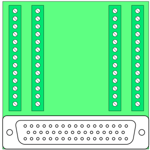
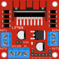

# Scorbot Robot Controller

---

title: Scorbot robot rebuild
layout: default

---

## Description

Arduino based motor controller for rescued Scorbot ER III robot arm.

## Project Goals

This is a messing around, learning project from getting a free robot arm. The Scorbot ER III is a circa 1995 robot. So simple, maybe even I can work with it!

The goals of the project are to

1. Learn
1. Restore the basic functionality of movement and encoders
1. Design and build an arduino based controller that accepts a joystick-type controller and data input to operate.
1. Enable design students to design and build a microbit based joystick controller
1. Design and build a case

## When might I quit this project?

- If motors, or encoders stop working
- If costs go above $200
- If effort goes beyond a few weeks

## TODO

- [] make 'home' the CW clockwise side of the microswitch. ~200 encoder steps from one side to the other.
- [] add 'middle' command to move joint to centerpoint of movement, so plastic cam cover can be moved there
- [] gripper home needs to be explored / defined
- [] wrist pitch and roll movements depend on motors 4-5 working together differential drive
- [] shoulder find home
- [x] write arduino code to get arm to move to home position
- [x] make replacement microswitch cams

## Project Log

- January 2026

  - Rough layout of parts on a board - the motors move!
  - modeled and printed controller case. Much easier thinking after just picking a layout. next time would just print base and areas under the ports.
  - Wired up mega, DB-50 connector and 3 L298N's. My soldering skills are very limited. I would use screw terminal shield for the Arduino Mega next time.
  - motors are working, basically. appear a bit slow, but power supply seems to be working. Desktop power supply reads roughly .5amps when motors are running.
  - the motors seems to need a high PWM value to move at all. I tested voltage across 12v power supply and PWM and appear in range.
  - `scorbot.h` is where I'm storing definitions and shared functions
  - `/helpers/` has working test files
  - `helpers/pin_test/pin_test.ino` was looking for shorts, etc in the arduino mega pins, due to my clumsy work. surprisingly I got it right on the first try
  - `helpers/motor_only_test/motor_only_test.ino` just moves the motors back and forth
  - `helpers/base_motor_test/base_motor_test.ino` is testing for homing and encoders for just the base motor
  - [Scorbot ER-4U][https://www.theoldrobots.com/book45/ER4u_User_Manual.pdf] seems to be essentially the same machine
  - note that Shoulder, Elbow, Wrist Pitch are built in such a way that wrist pitch remains consistent relative as shoulder and elbow move. Moving the shoulder does NOT simply swing the gripper tip relative to the shoulder. Moving the shoulder rotates the elbow to keep the wrist pitch steady. This is cool / confusing. probably needs kinematics

- December 2025

  - modeled `scorbot joint cover with microswitch cam.stl`, printed and replaced cams. 1 original cam remains
  - ordered L298Ns, Arduino Mega, power supply

- August 2025

  - Got Scorbot ER III discarded by friends at NYC First. No controller or documentation
  - serial number 2090047 model "robot"
  - identified it as scorbot ER iii, found documentation and github projects.
  - Motors can be moved with basic 12v .5A power.
  - Gripper does not move, carefully opening it, seems like encoder case is bent, propellor hitting encoder and LEDs
  - Wrist roll microswitch is hanging off, which may be related.
  - I'm going to run motors on 12v power
  - all 5 microswitch work from switch leads and the pins
  - microswitch cam discs that trigger switches at home point are broken for shoulder, elbow, wrist. for shoulder, using broken pieces, looks like trigger radius is 30mm, clearance is 26-28mm. cup depth is 10mm, center hole dia is 6mm
  - Repaired the Gripper motor and the encoder, which was banged in. microswitch re-attached
  - gripper motor plate uses unusual 3.5mm hex for screws
  - using multimeter on Gripper and base, it seems motor encoders work!
  - Motors do NOT have auto stop switches at ends of rotation. assume they do it in software
  - cams are missing, but based on base, the 'home' position, where microswitch is, should be the center of movement.
  - confirmed Gripper encoder works, hand spinning disc. 47 ohm resistor works to LED. LED is infrared, not visible. photoresistor needs 10k pull up to 5v each to pin 0 and 1, where signal is read. (Arduino has this built in)
  - assuming other encoders work, proceeding with buying parts
  - arduino mega has 5v outputs
  - L298N H bridge enable pins can be PWM'd for speed control

## Project Parts List

- Scorbot ER iii robot arm, without controller or Teaching pendant (~$400-1000)
- [Arduino-type Mega board](https://a.co/d/h9p4QL3)
- [D-50 style connector board](https://a.co/d/717fIG9)
- [L298N dual h bridge motor controller](https://a.co/d/8DAa5Af)
- [12v 10 amp power supply](https://a.co/d/0ydMZDN)

## Scorbot Description

[Scorbot ER III Manual](/references/ER3-Manual.pdf)

### Summary

| Specification | Value |
| **Mechanical Structure** | Vertically articulated |
| **Axes** | 5 axes plus gripper |
| **Control** | 8 axes simultaneously |
| **Working Envelope** | |
| Axis 1: Base Rotation | 310° |
| Axis 2: Shoulder Rotation | +130° / –35° |
| Axis 3: Elbow Rotation | ±130° |
| Axis 4: Wrist Pitch | ±130° |
| Axis 5: Wrist Roll | Unlimited |
| **Maximum Working Radius** | 610 mm (24.4") |
| **Gripper Opening** | 75 mm (3") without rubber pads 65 mm (2.56") with rubber pads |
| **Maximum Work Load** | 1 kg (2.2 lb.) |
| **Transmission** | Gears, timing belts and lead screw |
| **Actuators** | 6 DC servo motors with closed-loop control |
| **Feedback** | Optical encoders on all axes |
| **Hard Home** | Fixed reference position on all axes |
| **Repeatability** | ±0.5 mm (±0.02") |
| **Maximum Speed** | 330 mm/sec. (13"/sec.) |
| **Weight** | |
| Robot Arm | 11 kg (24 lb.) |
| Controller | 5 kg (11 lb.) |

### Original power supply

- - 15V, 4A, unregulated, supplies power to the robot motors.
- –15V, 4A, unregulated, supplies power to the robot motors.
- - 5V, 1.5A, regulated, supplies power to the microprocessor, the memory and the logic in the control circuit.
- - 12V, 0.4A, regulated, supplies power to the I/O circuitry outputs, and to the RS232 communications.
- –12V, 0.4A, regulated, supplies power to the RS232 communications.

### Motors

- Motors 1,2,3 Pittman GM9413G608 127.7:1 ratio
- Motors 4,5 Pittman GM9413F759 65.5:1 ratio
- Motor 6 Gripper Pittman GM8712F297 19.5:1 ratio

### Scorbot Cable connector

The Scorbot cable connector is an [DB 50](https://en.wikipedia.org/wiki/D-subminiature) cable. Connectors and breakout boards that fit are available at Amazon or Ali Express. [DB 50 connector Specification](https://www.farnell.com/datasheets/1656989.pdf) [DB50 diagram](https://upload.wikimedia.org/wikipedia/commons/a/af/DD50_Diagram.svg)

Here is the pin numbers (looking at the male scorbot cable connector pins)

<pre>
────────────────────────────────────────────────────────────────────────────────────────────
╲   (1)  (2)  (3)  (4)  (5)  (6)  (7)  (8)  (9)  (10) (11) (12) (13) (14) (15) (16) (17)   ╱
 ╲    (18) (19) (20) (21) (22) (23) (24) (25) (26) (27) (28) (29) (30) (31) (32) (33)     ╱
  ╲ (34) (35) (36) (37) (38) (39) (40) (41) (42) (43) (44) (45) (46) (47) (48) (49) (50) ╱
    ─────────────────────────────────────────────────────────────────────────────────────
</pre>

## SCORBOT ER III WIRING GUIDE

### TABLE 1: DB-50 CONNECTOR TO ARDUINO MEGA

| DB-50 Pin | Motor | Joint       | Signal               | Arduino Pin | L298N Board | L298N Input | L298N Output | Notes                     |
| --------- | ----- | ----------- | -------------------- | ----------- | ----------- | ----------- | ------------ | ------------------------- |
| 1         | 2     | Shoulder    | Encoder P0           | 36          |             |             |              |                           |
| 2         | 1     | Base        | Encoder P0           | 34          |             |             |              |                           |
| 3         | 5     | Wrist Roll  | Encoder P1           | 43          |             |             |              |                           |
| 4         | 3     | Elbow       | Encoder P1           | 39          |             |             |              |                           |
| 5         | 1     | Base        | Encoder P1           | 35          |             |             |              |                           |
| 6         | 5     | Wrist Roll  | Microswitch          | 50          |             |             |              |                           |
| 7         | 2     | Shoulder    | Microswitch          | 47          |             |             |              |                           |
| 8         | 4     | Wrist Pitch | Microswitch          | 49          |             |             |              |                           |
| 9         | 5     | Wrist Roll  | Encoder LED          | 5V via 47Ω  |             |             |              |                           |
| 10        | 3     | Elbow       | Encoder LED          | 5V via 47Ω  |             |             |              |                           |
| 11        | 1     | Base        | Encoder LED          | 5V via 47Ω  |             |             |              |                           |
| 12        | 6     | Gripper     | Motor +              | 32          | 3           | 3           | 3            |                           |
| 13        | 5     | Wrist Roll  | Motor +              | 30          | 3           | 1           | 1            |                           |
| 14        | 4     | Wrist Pitch | Motor +              | 28          | 2           | 3           | 3            |                           |
| 15        | 3     | Elbow       | Motor +              | 26          | 2           | 1           | 1            |                           |
| 16        | 2     | Shoulder    | Motor +              | 24          | 1           | 3           | 3            |                           |
| 17        | 1     | Base        | Motor +              | 22          | 1           | 1           | 1            |                           |
| 18        | 5     | Wrist Roll  | Encoder P0           | 42          |             |             |              |                           |
| 19        | 6     | Gripper     | Encoder P1           | 45          |             |             |              |                           |
| 20        | 4     | Wrist Pitch | Encoder P1           | 41          |             |             |              |                           |
| 21        | 2     | Shoulder    | Encoder P1           | 37          |             |             |              |                           |
| 22        | 6     | Gripper     | Microswitch          | -           |             |             |              | manual says not connected |
| 23        | 1     | Base        | Microswitch          | 46          |             |             |              |                           |
| 24        | 3     | Elbow       | Microswitch          | 48          |             |             |              |                           |
| 25        | 6     | Gripper     | Encoder LED          | 5V via 47Ω  |             |             |              |                           |
| 26        | 4     | Wrist Pitch | Encoder LED          | 5V via 47Ω  |             |             |              |                           |
| 27        | 2     | Shoulder    | Encoder LED          | 5V via 47Ω  |             |             |              |                           |
| 28        | 6     | Gripper     | Encoder GND          | GND         |             |             |              |                           |
| 29        | 5     | Wrist Roll  | Switch & Encoder GND | GND         |             |             |              |                           |
| 30        | 4     | Wrist Pitch | Switch & Encoder GND | GND         |             |             |              |                           |
| 31        | 3     | Elbow       | Switch & Encoder GND | GND         |             |             |              |                           |
| 32        | 2     | Shoulder    | Switch & Encoder GND | GND         |             |             |              |                           |
| 33        | 1     | Base        | Switch & Encoder GND | GND         |             |             |              |                           |
| 34        | 6     | Gripper     | Encoder P0           | 44          |             |             |              |                           |
| 35        | 4     | Wrist Pitch | Encoder P0           | 40          |             |             |              |                           |
| 36        | 3     | Elbow       | Encoder P0           | 38          |             |             |              |                           |
| 37        | -     | -           | -                    | -           |             |             |              |                           |
| 38        | -     | -           | -                    | -           |             |             |              |                           |
| 39        | -     | -           | -                    | -           |             |             |              |                           |
| 40        | -     | -           | -                    | -           |             |             |              |                           |
| 41        | -     | -           | -                    | -           |             |             |              |                           |
| 42        | -     | -           | -                    | -           |             |             |              |                           |
| 43        | -     | -           | -                    | -           |             |             |              |                           |
| 44        | -     | -           | -                    | -           |             |             |              |                           |
| 45        | 6     | Gripper     | Motor -              | 33          | 3           | 4           | 4            |                           |
| 46        | 5     | Wrist Roll  | Motor -              | 31          | 3           | 2           | 2            |                           |
| 47        | 4     | Wrist Pitch | Motor -              | 29          | 2           | 4           | 4            |                           |
| 48        | 3     | Elbow       | Motor -              | 27          | 2           | 2           | 2            |                           |
| 49        | 2     | Shoulder    | Motor -              | 25          | 1           | 4           | 4            |                           |
| 50        | 1     | Base        | Motor -              | 23          | 1           | 2           | 2            |                           |
| -         | 1     | Base        | PWM (motor speed)    | 7           | 1           |             | ENA          |                           |
| -         | 2     | Shoulder    | PWM (motor speed)    | 6           | 1           |             | ENB          |                           |
| -         | 3     | Elbow       | PWM (motor speed)    | 5           | 2           |             | ENA          |                           |
| -         | 4     | Wrist Pitch | PWM (motor speed)    | 4           | 2           |             | ENB          |                           |
| -         | 5     | Wrist Roll  | PWM (motor speed)    | 3           | 3           |             | ENA          |                           |
| -         | 6     | Gripper     | PWM (motor speed)    | 2           | 3           |             | ENB          |                           |

### TABLE 2: POWER CONNECTIONS

| Component         | Connection | Source                         | Notes                      |
| ----------------- | ---------- | ------------------------------ | -------------------------- |
| Arduino Mega      | 12V Vin    | Common 12v plug or Barrel Jack | Powers logic               |
| Arduino Mega      | GND        | Common Ground                  | Shared with all components |
| L298N Board 1-3   | 12V        | 12V 10A Power Supply           | Motor power                |
| L298N Board 1-3   | GND        | Common Ground                  | Shared ground              |
| Encoder LEDs (6x) | 5V         | Arduino 5V via 47Ω resistor    | One resistor per encoder   |
| Encoder LEDs GND  | GND        | DB-50 pins 28-33               | Common ground              |

### SERIAL COMMUNICATION

| Function | Arduino Pin | Purpose                                    |
| -------- | ----------- | ------------------------------------------ |
| TX       | 18          | Serial1 - transmit to joystick controller  |
| RX       | 19          | Serial1 - receive from joystick controller |

### WIRING TIPS

1. **Label everything** - use labels/tape on wires at both ends
2. **Color coding:**
   - Red: 12V power
   - Black: GND
   - Yellow/Green: encoders
   - Blue: microswitches
   - Other colors: motor control signals
3. **Use a breakout board** for the DB-50 connector
4. **Bundle by function** - keep motor, encoder, and switch wires separated
5. **Consider a prototype shield** or custom PCB for clean organization

## Spec sheets and Manuals

- [Scorbot ER III Manual](https://www.theoldrobots.com/book45/ER3-Manual.pdf)
- [Arduino Mega sheet](https://content.arduino.cc/assets/Pinout-Mega2560rev3_latest.pdf)
- [Arduino Mega details](https://docs.arduino.cc/hardware/mega-2560/)
- [L298N dual H bridge motor controller](https://www.handsontec.com/dataspecs/L298N%20Motor%20Driver.pdf)

## CAD

- [SCORBOT ER4u Robotic Arm](https://grabcad.com/library/scorbot-er4u-robotic-arm-1)
- [L298N dual H bridge motor controller](https://grabcad.com/library/motor-driver-l298n-2)
- [DB50 Connector](https://grabcad.com/library/panel-connector)
- [DB50 dimensions](https://my.misumi-ec.com/linked/item/10500001630/img/SEA_oth_04large.gif)
- [Arduino Mega](https://grabcad.com/library/arduino-mega-17)

## Diagrams

## Scorbot GitHub Projects

| Project Name                                                                                         | Associated Web Pages                                                                                                                                                                                                                                                                                                                                                        | Brief Description                                                                                                                                                               |
| ---------------------------------------------------------------------------------------------------- | --------------------------------------------------------------------------------------------------------------------------------------------------------------------------------------------------------------------------------------------------------------------------------------------------------------------------------------------------------------------------- | ------------------------------------------------------------------------------------------------------------------------------------------------------------------------------- |
| [**Scorbot**](https://github.com/amiravni/Scorbot)                                                   | • [My Name is Scorbot](http://www.whatimade.today/my-name-is-scorbot/) • [Scorbot learns to draw"](http://whatimade.today/geekcon-xii-scorbot-learns-to-draw/) • [Hackaday Project: "Reviving Scorbot"](https://hackaday.io/project/3756-reviving-scorbot) • [Author's Blog](http://www.whatimade.today/author/amiravni/)                                          | Arduino MEGA-based controller for Scorbot ER-V with 6-encoder system, custom PCB shield, and Python drawing capabilities. Complete reverse engineering from junkyard condition. |
| [**robotic-arm**](https://github.com/ethanleep/robotic-arm)                                          | • [Scorbot ER-III Manual](https://usermanual.wiki/Document/Scorbot20ERIII20manual.259237025/help)                                                                                                                                                                                                                                                                           | Custom controller replacement for Scorbot-ER III with serial and hard-coded control modes. Arduino-based system with comprehensive reference documentation.                     |
| [**Scorbot**](https://github.com/luisp23/Scorbot)                                                    | • [Author's Portfolio](https://www.luispimen.com/) • [CS 287: Advanced Robotics Course](https://people.eecs.berkeley.edu/~pabbeel/cs287-fa19/)                                                                                                                                                                                                                           | Arduino-based joystick controller for Scorbot robotic arm as cost-effective alternative to expensive original controller. Georgia Tech ECE project.                             |
| [**Scorbot-ER-V-Simulator-Controller**](https://github.com/aamitn/Scorbot-ER-V-Simulator-Controller) | • [Hackster.io Project](https://www.hackster.io/amitnandileo/scorbot-er-v-controller-simulator-design-1a2d6f) • [Arduino Project Hub](https://create.arduino.cc/projecthub/amitnandileo/scorbot-er-v-controller-simulator-design-1a2d6f) • [Author's Website](https://aamitn.github.io/) • [ResearchGate Profile](https://www.researchgate.net/profile/Amit-Nandi) | Professional-grade MATLAB simulation software and hardware controller for Scorbot ER-V+ with PID control, ROS integration, and industrial safety features.                      |
| [**OpenScorbot**](https://github.com/jamofer/OpenScorbot)                                            | • Author: Software Engineer at Casa-Systems                                                                                                                                                                                                                                                                                                                                 | Complete open-source hardware/software controller replacement for SCORBOT ER-IX.                                                                                                |
| [**ScorBotToolbox**](https://github.com/kutzer/ScorBotToolbox)                                       | • [USNA Documentation](https://www.usna.edu/Users/weapron/kutzer/_Code-Development/ScorBot_Toolbox.php) • [MATLAB File Exchange](https://www.mathworks.com/matlabcentral/fileexchange/52830-kutzer-scorbottoolbox) • [Legacy MTIS Toolbox](https://www.usna.edu/Users/weapsys/esposito/scorbot.matlab.php)                                                            | MATLAB toolbox for interfacing and simulating Intelitek ScorBot-ER 4U educational robot with comprehensive control and visualization capabilities.                              |
| [**ED-Scorbot**](https://github.com/RTC-research-group/ED-Scorbot)                                   | • [University Research Page](http://www.rtc.us.es/ed-scorbot) • [ROS Simulation](http://www.rosject.io/l/11c04055/)                                                                                                                                                                                                                                                      | Event-based Scorbot ER-VII platform for neuromorphic research with spike-based controllers, FPGA integration, and spiking neural networks.                                      |
| [**scorbot**](https://github.com/rorromr/scorbot)                                                    | • Limited documentation available                                                                                                                                                                                                                                                                                                                                           | Scorbot ER-VII implementation with basic functionality.                                                                                                                         |
| [**SCORBOT-ER-VII**](https://github.com/JHONAURBANOD/SCORBOT-ER-VII)                                 | • Gazebo simulation files included                                                                                                                                                                                                                                                                                                                                          | Contains simulation files for Scorbot ER-VII in Gazebo robotics simulator environment.                                                                                          |
| [**scorbot-simulator**](https://github.com/oscarjcg/scorbot-simulator)                               | • [YouTube Demo](https://www.youtube.com/watch?v=9E7pBUh7wQg) • [Documentation](https://alu0100825893.github.io/ScorbotSimulator/Docs/html/annotated.html)                                                                                                                                                                                                               | Unity-based Scorbot simulator with graphic interface, includes video demonstrations and comprehensive Doxygen documentation. Built with Unity 2017.4.1f1.                       |
| [**openScorbot**](https://github.com/tidus747/openScorbot)                                           | • Spanish documentation included                                                                                                                                                                                                                                                                                                                                            | Free controller for Scorbot ER-4U with Python 3.6.9 and Qt 5 Designer GUI.                                                                                                      |
| [**scorbot**](https://github.com/PlanBCode/scorbot)                                                  | • Processing-based interface documentation                                                                                                                                                                                                                                                                                                                                  | Processing code for mouse-controlled Scorbot-ER V Plus with coordinate mapping system. Future goal: Game of Life with marbles.                                                  |
| [**scorbot_config**](https://github.com/greenpro/scorbot_config)                                     | • [CraigCode1010.com](http://craigcode1010.com/) • Complete SAC project documentation                                                                                                                                                                                                                                                                                    | Configuration files for Scorbot integration with MoveIt motion planning framework. Part of SAC (Scorbot Arm Control) project.                                                   |
| [**sac_description**](https://github.com/greenpro/sac_description)                                   | • [Project Documentation](http://craigcode1010.com/) • ROS system topology details                                                                                                                                                                                                                                                                                       | ROS package with URDF descriptions for Southern Adventist University robotic arm simulation, includes Scorbot modeling for Gazebo.                                              |
| [**r2d3**](https://github.com/ajnsit/r2d3)                                                           | • Cross-platform simulator documentation                                                                                                                                                                                                                                                                                                                                    | Free robotic manipulator simulator using Blender and Python, specifically designed for Scorbot ER-V with forward/inverse kinematics and ACL programming support.                |
| [**sboter4u**](https://github.com/baijuch/sboter4u/tree/master)                                      | • Scorbot ER4U robot configuration using Moveit                                                                                                                                                                                                                                                                                                                             |                                                                                                                                                                                 |

### Other Robot Arm Projects

- [PAROL6](https://github.com/PCrnjak/PAROL6-Desktop-robot-arm)
- [BCN3D Moveo](https://github.com/BCN3D/BCN3D-Moveo)
- [LeRobot](https://github.com/huggingface/lerobot)
- [Faze4-Robotic-arm](https://github.com/PCrnjak/Faze4-Robotic-arm)
